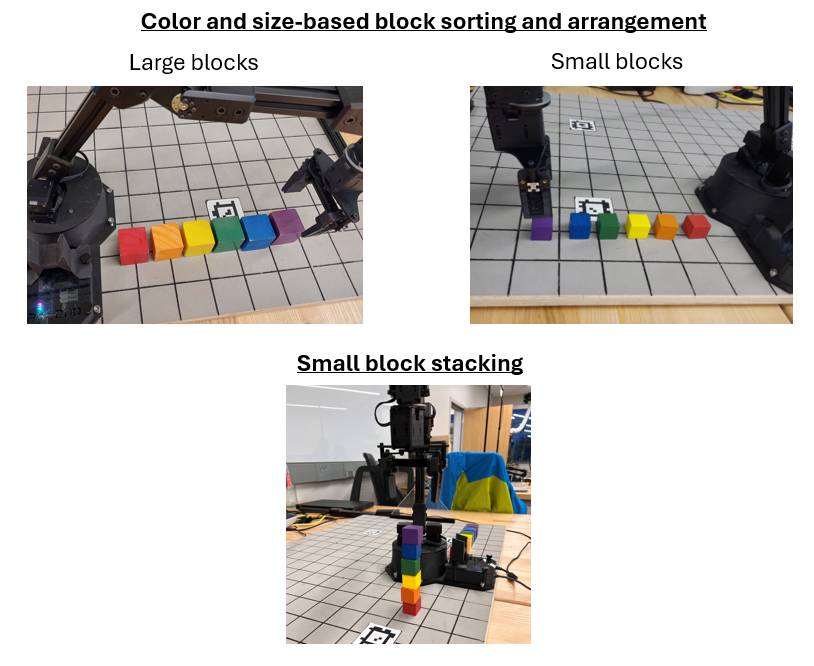
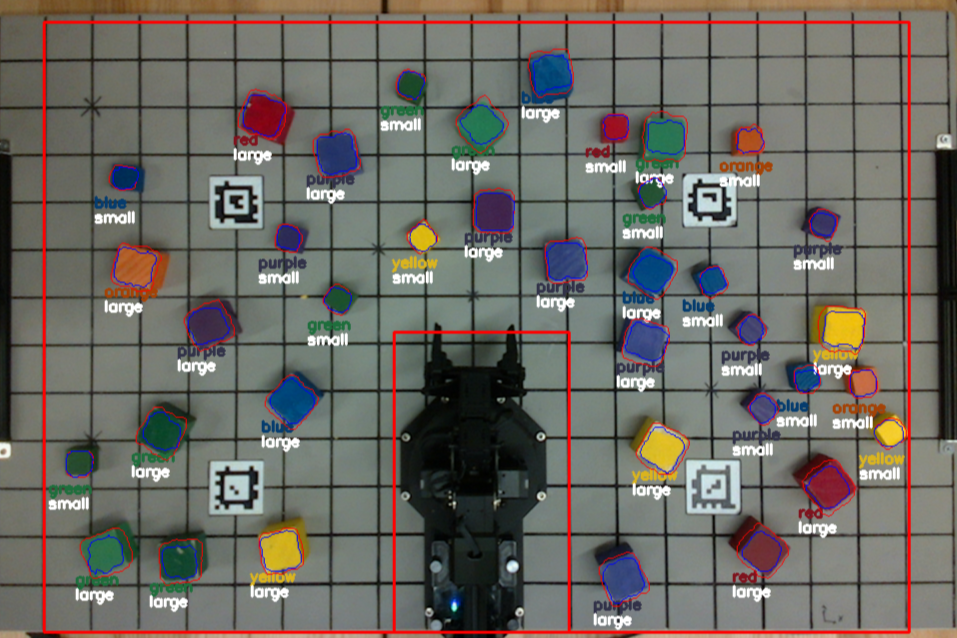
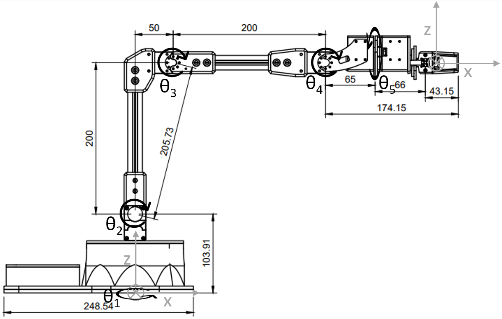

# Vision-based Autonomous Manipulation

A 5-degree-of-freedom robotic arm autonomously organizes blocks of varying sizes, colors, and placements into a target configuration. Analytical inverse kinematics calculates the necessary waypoints for positioning the end-effector, while a heuristic motion planning approach generates feasible paths. An overhead Intel RealSense LiDAR camera detects the blocks on the board, and homogeneous transformations convert the pixel and depth data into real-world coordinates. For added accuracy, the extrinsic matrix is calibrated using four AprilTags with known positions.

## Sensing

Using the LiDAR camera, we developed a reliable vision system that autonomously performs hand-eye calibration with the Interbotix ReactorX-200 5-DOF robotic arm. This system detects and classifies blocks in real time (25 FPS), identifying their locations in both 2D and 3D, as well as their colors (ranging from red to purple), sizes (large and small), and orientations. It achieves a 99.5% accuracy rate in color classification.

  
  

https://user-images.githubusercontent.com/44640904/200190783-980dbcec-e18d-4306-8e8d-24b5c22ff71d.mp4

## Hardwares

The system consists of an Interbotix ReactorX-200 5-DOF robotic arm, an Intel RealSense LiDAR Camera L515 for vision processing, and an Dell Laptop with Intel i7 CPU for computation.

## Acting

The forward kinematics is implemented using product of exponential method. The inverse kinematics is then solved analytically by decomposing the
set of joint variables. The path planning generate a list of joint angles for the arm when picking or placing blocks. In the state machine, the logic of the competition events are implemented.

